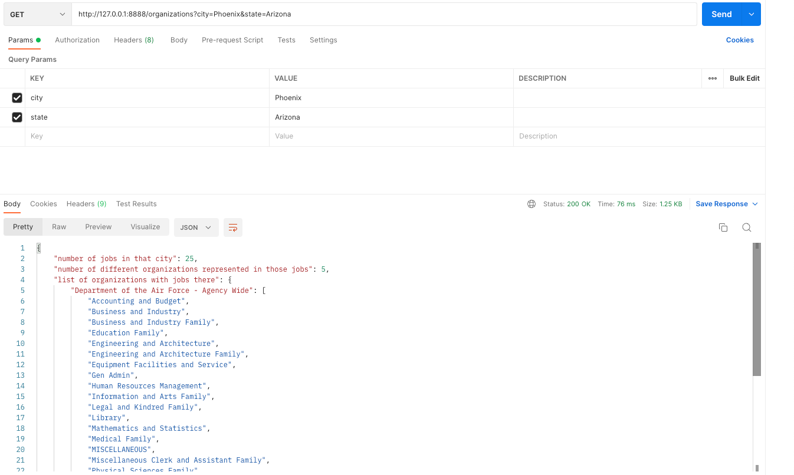

## Purpose

Purpose of this exercise is to create django app around government job search 
since semantic based search wasn't working for upstream site. This project uses
wordhoard library in order to achieve sematic search.

## Step 1: Data ingestion

The data for our API will come a third party api, keys are free.

We will be getting job data from 

Usajobs.gov: https://developer.usajobs.gov/Tutorials/Search-Jobs 
(there is a link to apply for an API key in that page)

We will import all jobs available in the usajobs.gov search api into a local 
database. 
At the end of the ingestion process, local db should have all the information 
needed to run the apis specified below without having to further query the apis. 

ingestion process provides basic metrics on the process (number of jobs ingested, number of different locations ingested, time for each step)

## Step 2 Api creation

REST API services with the following interface:

Endpoint 1 (jobs):
- inputs:
  - location
  - list of keywords 
- outputs
  - number of jobs
  - oldest job (role and posted date)
  - newest job (role and posted date)

Endpoint 2 (organizations):
- inputs:
  - city
  - state
- outputs:
  - number of jobs in that city 
  - number of different organizations represented in those jobs
  - list of organizations with jobs there

## Setup

It would be great if you can test this on mac os since mysqlclient 
library isn't working well with windows. If you wish to run on windows, 
visit this page https://pypi.org/project/mysqlclient/ for installing 
connector C first (doesn't gurantee successful installation). On mac os, 
please run following command or similar based on package manager of your 
preference.
`brew install mysql`

Keep the server running. This is needed for library mysqlclient, when we 
will create virtual environment later.
`brew services start mysql`

please make sure your docker is up & running. Please run following 
command to create db docker container, inside project directory 
(cd JobSearch)
`make build`
`make up`

Please
install python 3.9.6 and create virtual environment out of it 
Install dependencies using requirements.txt under project directory.
`pip install -r requirements.txt`

Please run following command to create tables under database
`python manage.py makemigrations`
`python manage.py migrate`

## Scraping from usajobs endpoint

Please obtain authorization-key from here 
https://developer.usajobs.gov/APIRequest/ and user-agent from usajobs 
website. User-agent is your email address used to obtain authorization-key.

Please fill in those in .env file under project directory.
USER_AGENT= (email addressed registered)
AUTHORIZATION_KEY= (key emailed to you by usajobs website after filling the 
form https://developer.usajobs.gov/APIRequest/)

Please run following django command inside project's virtual environment.
This will fill in all database tables by scraping information from upstream
usajobs endpoints. This can be twicked to scrape more data from upstream.
`python manage.py scrape --keyword="software" --location="Phoenix, Arizona"`

## Endpoints created as part of this story

Please go to your virtual environment & type in following command to 
start the server

`python manage.py runserver 8888` 

Endpoint 1:
e.g. http://127.0.0.1:8888/jobs?location=Phoenix,%20Arizona&keywords=engineer,%20lawyer

or

http://localhost:8888/jobs?location=Phoenix,%20Arizona&keywords=engineer,%20lawyer

This endpoint expects location as required field & keywords parameter is 
optional and comma seperated.

Endpoint 2:
e.g. http://127.0.0.1:8888/organizations?city=Los%20Angeles&state=California

or

http://localhost:8888/organizations?city=Los%20Angeles&state=California

This endpoint expects city & state as required fields.

You can now experiment for results putting in different locations, keywords, 
city & state.

You can also use tools like postman in order to test endpoints so json response
can be better looked at.

