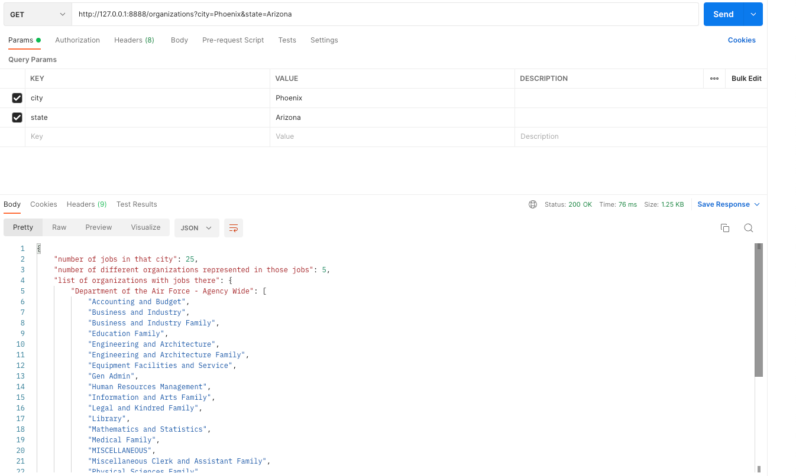

## Setup

Please use feature branch to get updates pushed by Shree.

It would be great if you can test this on mac os since mysqlclient 
library isn't working well with windows. If you wish to run on windows, 
visit this page https://pypi.org/project/mysqlclient/ for installing 
connector C first (doesn't gurantee successful installation). On mac os, 
please run following command or similar based on package manager of your 
preference.
`brew install mysql`

Keep the server running. This is needed for library mysqlclient, when we 
will create virtual environment later.
`brew services start mysql`

please make sure your docker is up & running. Please run following 
command to create db docker container, inside project directory 
(cd python_project_kulkarni)
`make build`
`make up`

I was unsuccessful creating `web` pod due to technical issues. So please
install python 3.8.9 and create virtual environment out of it 
Install dependencies using requirements.txt under project directory.
`pip install -r requirements.txt`

Please run following command to create tables under database
`python manage.py makemigrations`
`python manage.py migrate`

## Scraping from usajobs endpoint

Please obtain authorization-key from here 
https://developer.usajobs.gov/APIRequest/ and user-agent from usajobs 
website. User-agent is your email address used to obtain authorization-key.

Please fill in those in .env file under project directory.
USER_AGENT= (email addressed registered)
AUTHORIZATION_KEY= (key emailed to you by usajobs website after filling the 
form https://developer.usajobs.gov/APIRequest/)

Please run following django command inside project's virtual environment.
This will fill in all database tables by scraping information from upstream
usajobs endpoints. This can be twicked to scrape more data from upstream.
`python manage.py scrape --keyword="software" --location="Phoenix, Arizona"`

## Endpoints created as part of this story

Please go to your virtual environment & type in following command to 
start the server

`python manage.py runserver 8888` 

Endpoint 1:
e.g. http://127.0.0.1:8888/jobs?location=Phoenix,%20Arizona&keywords=engineer,%20lawyer

or

http://localhost:8888/jobs?location=Phoenix,%20Arizona&keywords=engineer,%20lawyer

This endpoint expects location as required field & keywords parameter is 
optional and comma seperated.

Endpoint 2:
e.g. http://127.0.0.1:8888/organizations?city=Los%20Angeles&state=California

or

http://localhost:8888/organizations?city=Los%20Angeles&state=California

This endpoint expects city & state as required fields.

You can now experiment for results putting in different locations, keywords, 
city & state.

You can also use tools like postman in order to test endpoints so json response
can be better looked at.

